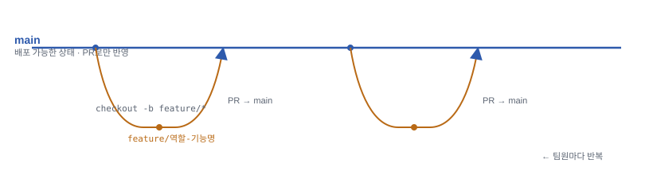

# 동네 진단 서비스 (dongne-jindan)

자취방·이사할 지역을 고르기 전, 주소 하나만 입력하면 **안전·생활편의·교통 접근성**을 종합 점수화해서 보여주는 웹 서비스입니다.

자세한 배경과 설계 결정은 [`docs/프로젝트_가이드.md`](./docs/프로젝트_가이드.md)를 참고하세요.

## 폴더 구조

```
dongne-jindan/
├── frontend/   # React (Vite) — 화면 UI
├── backend/    # Python + FastAPI — API 서버
├── data/       # 공공데이터 원본/전처리 스크립트
├── docs/       # 기획 문서, 요구사항표, 다이어그램
└── .github/    # PR 템플릿 등
```

## 로컬 실행 방법

### 1. 백엔드
```bash
cd backend
python3 -m venv .venv
source .venv/bin/activate        # Windows: .venv\Scripts\activate
pip install -r requirements.txt
cp .env.example .env             # 발급받은 API 키·DB 정보 입력
uvicorn app.main:app --reload
```
기본 주소: http://localhost:8000 (API 문서: http://localhost:8000/docs)

### 2. 프론트엔드
```bash
cd frontend
npm install
cp .env.example .env             # 카카오 JS 키 입력
npm run dev
```
기본 주소: http://localhost:5173

## 기술 스택

| 영역 | 기술 |
|---|---|
| 프론트엔드 | React (Vite) + Tailwind CSS |
| 백엔드 | Python + FastAPI |
| 데이터베이스 | Turso (libSQL) |
| 데이터 전처리 | Python + pandas |
| 배포 | Vercel(프론트) + Render(백엔드) |

## 팀 협업 규칙

- 브랜치: `main`(배포) ← `feature/역할-기능명`
- 커밋 메시지: `feat:`, `fix:`, `docs:` 접두어 사용
- 새 기능은 `main` 대상 PR로 생성 후 팀원 1명 리뷰 → 머지

> 처음엔 `main ← dev ← feature/*` 구조로 계획했으나(dev 브랜치 통합 후 주기적으로 main 배포), 팀 규모와 배포 주기를 고려해 `dev`를 없애고 feature 브랜치가 PR로 바로 `main`에 합쳐지는 방식으로 단순화했습니다.

자세한 배경 설명은 `docs/프로젝트_가이드.md`의 GitHub 협업 워크플로우 섹션 참고. 아래는 실제로 따라 치면 되는 명령어 튜토리얼입니다.

## 브랜치 관계 한눈에 보기



feature 브랜치는 `main`에서 갈라져 나와, 작업이 끝나면 PR을 거쳐 바로 `main`으로 합쳐집니다. 별도의 통합 브랜치(dev) 없이, 리뷰를 통과한 feature 브랜치만 `main`에 반영됩니다.

## 튜토리얼: 브랜치 생성 → 커밋 → PR

### 0. 최초 1회만: 저장소 클론 및 신원 등록
```bash
git clone https://github.com/Estasha/-DSU-SoftwareProject-Team-4.git   # 원격 저장소를 내 컴퓨터로 통째로 복사 (최초 1회만)
cd ./-DSU-SoftwareProject-Team-4   # 방금 만들어진 폴더로 이동 (저장소 이름이 '-'로 시작해서 앞에 ./ 필요)
git config --global user.name "본인 GitHub 아이디"      # 커밋에 "누가 했는지" 기록될 이름 등록
git config --global user.email "본인 GitHub 가입 이메일"  # 커밋에 기록될 이메일 등록 (GitHub 계정 이메일과 맞추기)
```

### 1. 작업 시작 전 `main`을 최신 상태로
```bash
git checkout main          # 지금 작업 브랜치를 main으로 전환 (로컬 파일 내용도 main 상태로 바뀜)
git pull origin main       # GitHub의 main 최신 내용을 내 컴퓨터로 받아오기
```
항상 `main`에서 새 브랜치를 파야 다른 팀원이 먼저 합친 내용을 놓치지 않습니다.

### 2. 기능 브랜치 생성
```bash
git checkout -b feature/역할-기능명   # -b: 새 브랜치를 만들면서 동시에 그 브랜치로 이동
```
예: `feature/backend-search-api`, `feature/frontend-score-card`, `feature/data-crime-cleaning`

### 3. 코드 작업 + 커밋
```bash
git status                     # 뭐가 바뀌었는지 확인
git add 파일명1 파일명2         # 커밋할 파일만 정확히 지정 (git add . 은 실수로 불필요한 파일이 낄 수 있음)
git commit -m "feat: 주소 검색 API 추가"   # add된 변경사항을 하나의 스냅샷(기록)으로 저장
```
의미 단위로 여러 번 커밋해도 됩니다. 메시지 접두어는 `feat:`(기능 추가) / `fix:`(버그 수정) / `docs:`(문서) / `chore:`(설정·잡일)를 사용합니다.

### 4. 원격에 브랜치 업로드
```bash
git push -u origin feature/역할-기능명   # 로컬 커밋들을 GitHub(origin)의 같은 이름 브랜치로 업로드
```
`-u`는 최초 1회만 필요 — 이후부터는 `git push`만 쳐도 이 브랜치로 올라갑니다.

### 5. PR(Pull Request) 생성
GitHub 웹에서 방금 푸시된 브랜치의 "Compare & pull request" 버튼을 눌러도 되고, GitHub CLI(`gh`)가 설치돼 있다면 터미널에서 바로:
```bash
gh pr create --base main --title "feat: 주소 검색 API 추가" --body "무엇을 했는지, 어떻게 테스트했는지 작성"
# --base main: "이 브랜치 내용을 main에 합쳐달라"는 뜻 (합쳐질 대상 브랜치)
# --title, --body: PR 제목과 설명 — 웹에서 나중에 수정 가능
```
**Base(대상 브랜치)는 반드시 `main`**으로 지정합니다. `.github/PULL_REQUEST_TEMPLATE.md` 양식(무엇을 했나요 / 어떻게 테스트했나요 / 관련 이슈 / 체크리스트)에 맞춰 작성하면 리뷰가 수월합니다.

### 6. 리뷰 및 머지
- 팀원 1명이 PR을 리뷰(Approve)하면 `main`에 머지
- 머지 후 GitHub에서 "Delete branch" 버튼으로 원격 브랜치 정리 (또는 아래 명령어)

### 7. 머지 후 로컬 정리
```bash
git checkout main                                # main 브랜치로 돌아오기
git pull origin main                             # 방금 머지된 내용 받기
git branch -d feature/역할-기능명                  # 로컬 브랜치 삭제 (이미 머지된 경우만 허용됨, -d는 소문자)
git push origin --delete feature/역할-기능명        # 원격(GitHub) 브랜치 삭제 (웹에서 안 지웠다면)
```
